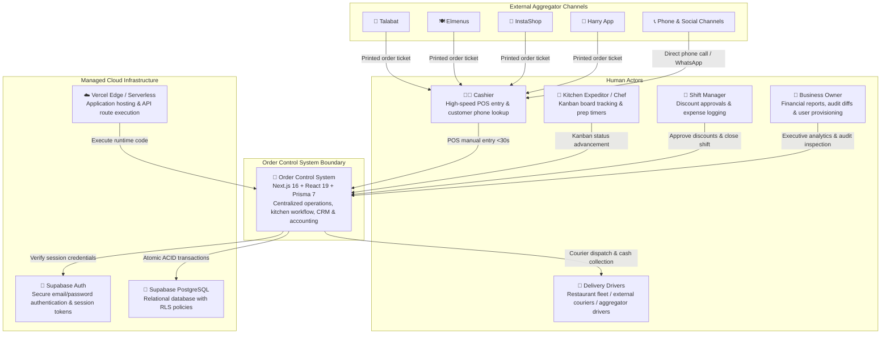
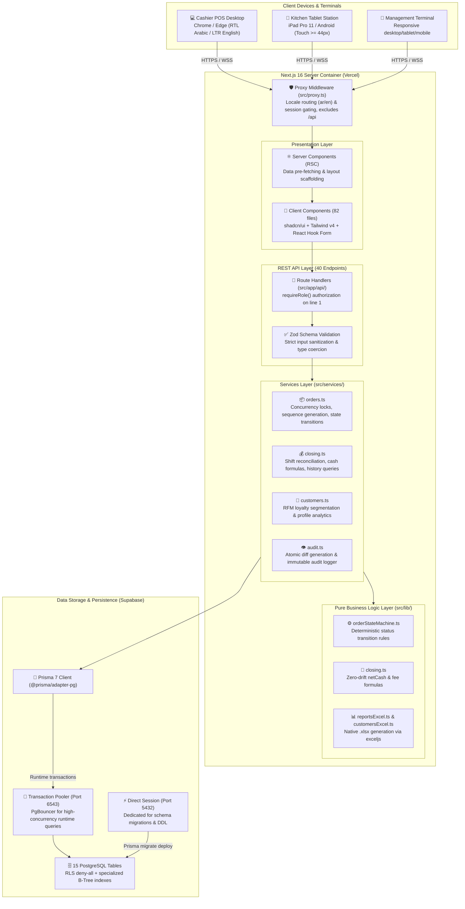
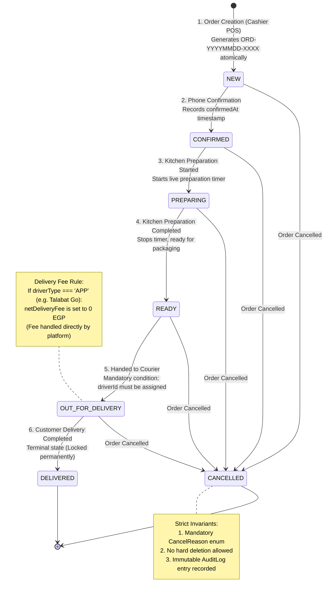
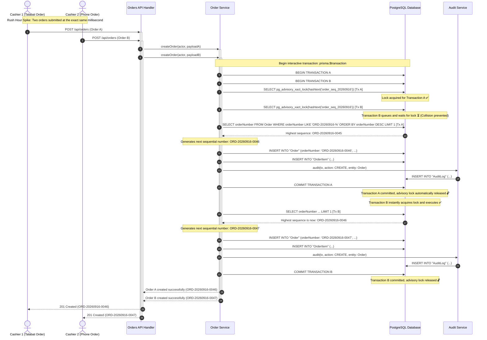
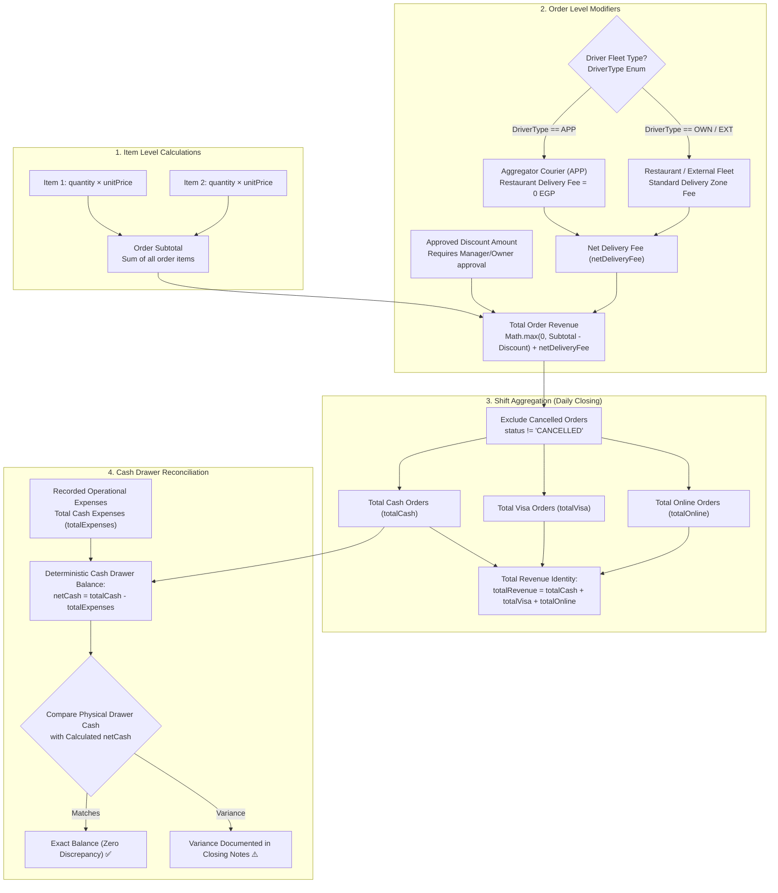

# System Architecture & Engineering Blueprint
## Order Control System — Multi-Brand Dark Kitchen Operating Platform

> **Printable Edition:** [📥 Download Executive PDF (A4 Edition)](PDFs/ARCHITECTURE.pdf)  
> **Architecture Approval Date:** September 16, 2026 | **Status:** Production-Grade & Fully Implemented

---

## Table of Contents
1. [Core Architectural Invariants](#1-core-architectural-invariants)
2. [C4 Model — Level 1: System Context](#2-c4-model--level-1-system-context)
3. [C4 Model — Level 2: Containers & Components](#3-c4-model--level-2-containers--components)
4. [Order State Machine Architecture](#4-order-state-machine-architecture)
5. [Rush Hour Concurrency & PostgreSQL Advisory Locking](#5-rush-hour-concurrency--postgresql-advisory-locking)
6. [Zero-Drift Financial Accounting Flow](#6-zero-drift-financial-accounting-flow)
7. [Role-Based Access Control & Audit Invariants](#7-role-based-access-control--audit-invariants)

---

## 1. Core Architectural Invariants

The Order Control System is the centralized operational platform for a multi-brand sushi dark kitchen operating 4 virtual brands (Flower Sushi, Mastery Sushi, Niwa Sushi, Tobiko Sushi) across 6 aggregator channels. The system operates on a 100% delivery model with no dine-in or customer pickup counters. 

The architecture is governed by five mandatory engineering directives:

1. **Zero Business Logic in UI:** All financial calculations, state machine transitions, and validation rules reside exclusively in `src/lib/`. Database mutations are strictly isolated in `src/services/`. UI components are pure presentation layers that dispatch actions and render state.
2. **Single Source of Truth:** Direct Prisma client invocations from UI pages or API route handlers are prohibited. Every order mutation must pass through `src/services/orders.ts`, which atomically records an immutable `audit()` log entry within the same interactive database transaction.
3. **Strict Immutability & No Hard Deletes:** No business record (Order, Customer, AuditLog) can ever be deleted. Cancellation is the only terminal state for orders and strictly requires an explicit `CancelReason`. Catalog entities enforce soft-deletion via `isActive = false`.
4. **Zero-Drift Financial Identity:** The financial equation `totalCash + totalVisa + totalOnline === totalRevenue` is mathematically enforced and fuzz-tested across 10,000+ randomized orders.
5. **Concurrency-Safe Sequencing:** Order numbers (`ORD-YYYYMMDD-XXXX`) are serialized using PostgreSQL transaction-level advisory locks (`pg_advisory_xact_lock`), completely preventing race conditions and sequence collisions during rush hours.

---

## 2. C4 Model — Level 1: System Context

The System Context diagram illustrates the system boundaries, human actors, and external aggregator platforms:

---

## 3. C4 Model — Level 2: Containers & Components

This diagram details the container architecture, communication protocols, and the internal separation of concerns:

---

## 4. Order State Machine Architecture

The order lifecycle adheres to a deterministic, unidirectional state machine. Backward status transitions are mathematically disallowed:

---

## 5. Rush Hour Concurrency & PostgreSQL Advisory Locking

To guarantee that multiple cashiers entering orders simultaneously during rush hours never collide or produce duplicate order numbers, the system utilizes PostgreSQL transaction-scoped advisory locks:

---

## 6. Zero-Drift Financial Accounting Flow

This flowchart illustrates the end-to-end financial calculation pipeline, from item pricing up to the cash drawer closing reconciliation:

---

## 7. Role-Based Access Control & Audit Invariants

### Access Control Matrix

| Resource & Operation | Cashier (`CASHIER`) | Manager (`MANAGER`) | Owner (`OWNER`) | Security Enforcement Mechanism |
|---|:---:|:---:|:---:|---|
| **Create & Search Orders** | ✅ Allowed | ✅ Allowed | ✅ Allowed | Session authentication |
| **Advance Order Statuses** | ✅ Allowed | ✅ Allowed | ✅ Allowed | State Machine validation |
| **Request Order Discount** | ✅ Allowed (with reason) | ✅ Allowed | ✅ Allowed | `DISCOUNT_REQUEST` event |
| **Approve / Reject Discounts** | ❌ Forbidden | ✅ Allowed | ✅ Allowed | `403 Forbidden` |
| **Open Operational Shift** | ✅ Allowed | ✅ Allowed | ✅ Allowed | Session authentication |
| **Record Daily Expense** | ✅ Allowed | ✅ Allowed | ✅ Allowed | Session authentication |
| **Close Shift & Reconcile Cash** | ❌ Forbidden | ✅ Allowed | ✅ Allowed | `403 Forbidden` |
| **Manage Menu Catalog & Prices** | ❌ Forbidden | ✅ Allowed | ✅ Allowed | `403 Forbidden` |
| **Analytics Dashboards & Reports** | ❌ Forbidden | ❌ Forbidden | ✅ Allowed | `403 Forbidden` |
| **Audit Trail Inspector & Diff Modal** | ❌ Forbidden | ❌ Forbidden | ✅ Allowed | `403 Forbidden` |
| **Staff User Provisioning & Roles** | ❌ Forbidden | ❌ Forbidden | ✅ Allowed | `403 Forbidden` |
| **Hard Delete Any Business Record** | 🚫 Prohibited | 🚫 Prohibited | 🚫 Prohibited | `405 Method Not Allowed` |

---
*Official Architecture Specification for Order Control System. Maintained by Core Engineering.*
