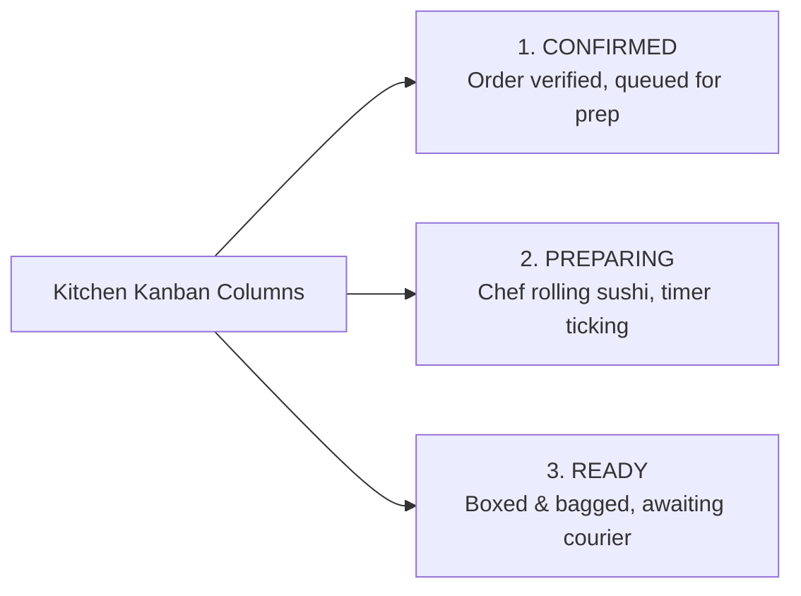

# Kitchen & Restaurant Operations Field Manual
## Order Control System — Multi-Brand Dark Kitchen Operating Platform

> **Printable Edition:** [📥 Download Executive PDF (A4 Edition)](PDFs/OPERATIONS_MANUAL.pdf)  
> **Release Date:** September 16, 2026 | **Operational Version:** v1.0 Production

---

## Table of Contents
1. [Introduction & Operational Environment](#1-introduction--operational-environment)
2. [Cashier Runbook (High-Speed POS)](#2-cashier-runbook-high-speed-pos)
3. [Kitchen Expeditor & Line Chef Runbook (Kanban Board)](#3-kitchen-expeditor--line-chef-runbook-kanban-board)
4. [Shift Manager Runbook (Shift Operations & Approvals)](#4-shift-manager-runbook-shift-operations--approvals)
5. [Business Owner & Finance Runbook (Audit & Closing)](#5-business-owner--finance-runbook-audit--closing)
6. [Incident Management Protocols](#6-incident-management-protocols)

---

## 1. Introduction & Operational Environment

This manual establishes standardized daily operational procedures for all dark kitchen personnel (Cashiers, Kitchen Expeditors, Sushi Chefs, Shift Managers, and Business Owners). It ensures orders are ingested, prepared, dispatched, and reconciled with maximum speed, zero data loss, and complete financial integrity.

### Hardware & Terminal Requirements
- **Cashier POS Station:** Desktop PC or laptop running Chrome or Edge browser, thermal receipt printer, and keyboard with dedicated Numpad.
- **Kitchen Preparation Station:** Wall-mounted, splash-proof tablet display (iPad Pro 11-inch or equivalent Android tablet with 1080p+ display) configured with "Always On" screen display.
- **Connectivity:** Redundant broadband connection with automated 4G/5G mobile hotspot failover to prevent order processing downtime during rush hours.

---

## 2. Cashier Runbook (High-Speed POS)

### Operational Target: Complete order ingestion from printed ticket or phone call in under 30 seconds.

```
+-----------------------------------------------------------------------------------------------+
|                             Rapid Order Workflow (< 30 Seconds)                               |
+-----------------------------------------------------------------------------------------------+
| [1] Platform & Brand ➔ [2] Customer Phone Lookup ➔ [3] Items & Modifiers ➔ [4] Payment & Driver |
+-----------------------------------------------------------------------------------------------+
```

### Step-by-Step Procedure:

#### 1. Sign In & Channel Selection
- Sign in with assigned employee credentials. The system redirects directly to the Cashier POS interface.
- Click **"New Order"** (or use keyboard shortcut `Ctrl+N` / `Alt+N`).
- Select the **Ordering Platform** (Talabat, Elmenus, InstaShop, Harry App, Facebook, Phone).
- Select the **Brand** (Flower Sushi, Mastery Sushi, Niwa Sushi, Tobiko Sushi). The menu automatically filters to display only items belonging to the selected brand.
- Enter the **External Aggregator Order ID** printed on the paper ticket (e.g. `TAL-482910`) for reconciliation.

#### 2. Customer Smart Lookup
- Enter the customer's 11-digit phone number (e.g. `01012345678`).
- **Returning Customer:**
  - Name, address, and delivery notes auto-populate immediately.
  - The customer's loyalty segment badge appears (VIP, Regular, New).
  - The **"Customer Favorites"** card displays their most ordered items with a single-click addition button (`+`).
  - If the customer has a history of cancellations or delivery disputes, an amber advisory banner appears to alert the cashier.
- **First-Time Customer:**
  - Enter customer name and delivery address. The system automatically creates a customer profile upon order submission.

#### 3. Menu Item Ingestion
- Filter items by category or type item name in the instant search box.
- Click item to add to the ticket; adjust quantity using `+` and `-` buttons.
- Enter any special customer preparation instructions in the notes field (e.g. "No spicy mayo", "Extra soy sauce", "Severe shellfish allergy").

#### 4. Payment Method & Fleet Selection
- **Payment Method:** Select Cash, Visa on Delivery, or Pre-paid Online.
- **Delivery Zone:** Select target zone to auto-calculate the fixed delivery fee.
- **Driver Fleet Assignment:**
  - **Aggregator Fleet (APP):** For orders delivered by aggregator couriers (e.g. Talabat Go), select **"APP Courier"**. The system automatically sets restaurant delivery fee to **0 EGP**.
  - **Restaurant Fleet (OWN / EXTERNAL):** Select the assigned in-house or third-party courier.

#### 5. Discount Request Protocol
- Cashiers cannot apply arbitrary discounts directly.
- If a customer provides a valid promotional code or compensation agreement:
  1. Click **"Request Discount"**.
  2. Enter discount amount in EGP.
  3. **Mandatory:** Enter a specific reason (e.g. "Weekend Promotion", "Late Delivery Compensation").
  4. Submit request; an alert notification dispatches immediately to the Shift Manager's dashboard.

#### 6. Order Cancellation Protocol
- **Fundamental Rule:** Direct deletion of orders is permanently prohibited in the database.
- To cancel an unfulfilled order:
  1. Select order and click **"Cancel Order"**.
  2. Select mandatory **Cancellation Reason**:
     - `Customer Changed Mind`
     - `No Answer / Phone Closed`
     - `Delivery Issue`
     - `Item Unavailable`
     - `Quality Issue`
     - `Other` (Requires explanatory text notes)
  3. Order state updates to `CANCELLED` and logs atomically to the Audit Trail.

---

## 3. Kitchen Expeditor & Line Chef Runbook (Kanban Board)

### The Kitchen Kanban Board synchronizes line preparation across all brands.



### Expeditor Procedures:

1. **Ticket Ingestion:**
   - Orders appear in the **CONFIRMED** column immediately upon cashier submission, triggering an audible alert.
2. **Commencing Preparation:**
   - When the chef begins cutting fish and rolling sushi, advance order to **PREPARING**.
   - **Live Preparation Timer:** An automated timer activates, displaying minutes and seconds elapsed since preparation commenced.
3. **Pulsing Overdue Alerts:**
   - **Normal / Green (0 – 10 minutes):** Preparation within target SLA.
   - **Warning / Amber (10 – 15 minutes):** Nearing maximum SLA; expedite finishing rolls.
   - **Critical / Red Pulsing (> 15 minutes):** **Overdue Order Alert**; kitchen supervisor intervenes immediately.
4. **Packaging & Quality Check:**
   - Verify roll count, pickled ginger, wasabi, and chopsticks against the digital ticket.
   - Box and seal order, advance status to **READY**. The preparation timer halts and records final kitchen lead time.
5. **Courier Handover:**
   - When the driver arrives, verify order number on receipt, assign driver if unassigned, and transition to **OUT_FOR_DELIVERY**.

---

## 4. Shift Manager Runbook (Shift Operations & Approvals)

### Daily Managerial Workflows:

#### 1. Shift Opening
- At the start of business, navigate to **Daily Closing** and click **"Open New Shift"**.
- Cashiers cannot record transactions without an active operational shift.

#### 2. Discount Approval Verification
- Pending cashier discount requests appear in the managerial notification queue.
- Manager reviews order value, customer history, and entered reason:
  - **Approve:** Discount applies instantly to order total; manager's identity is recorded in the audit log.
  - **Reject:** Discount is discarded; order reverts to full subtotal.

#### 3. Expense Logging (Petty Cash)
- Record all kitchen cash disbursements (fresh herbs, cleaning supplies, packaging materials, driver tips):
  1. Navigate to **Expenses** and click **"Record Expense"**.
  2. Select approved **Expense Category** (Supplies, Ingredients, Packaging, Maintenance, Transport).
  3. Enter amount, quantity, and brief description.
  4. Amount deducts automatically from expected drawer cash at closing.

---

## 5. Business Owner & Finance Runbook (Audit & Closing)

### Executive Oversight Procedures:

#### 1. End-of-Day Cash Drawer Reconciliation
At shift conclusion after the final order is delivered:
1. Navigate to **Daily Closing** and review the **Live Shift Preview** card.
2. Review aggregated figures:
   - Total Gross Revenue, Cash Orders, Visa Orders, and Online Orders.
   - Net Delivery Fees collected.
   - Total Shift Operational Expenses.
   - **Mandatory Calculated Drawer Cash (`netCash = totalCash - totalExpenses`).**
3. Count physical cash in drawer:
   - If exact match: Click **"Close Shift & Approve Closing"**.
   - If variance exists: Enter discrepancy amount in **Closing Notes** and submit for accounting review.

#### 2. Audit Trail Inspection
- Access the Owner-exclusive **Audit Log**:
  - Filter by date, user, or action (`STATUS_CHANGE`, `DISCOUNT_APPROVE`, `CANCEL`).
  - Click **"View Diff"** on any record to inspect the visual semantic diff (previous value in red, updated value in green with exact second timestamp).

#### 3. Executive Reporting & Export
- Export **Operations Master Workbook (`.xlsx`)**: Generates a native, multi-sheet workbook containing daily revenues, platform performance, top-selling sushi rolls, and payment reconciliations.
- Print **Executive PDF Report**: Produces an A4 print-optimized summary complete with KPI cards and formal signature blocks.

---

## 6. Incident Management Protocols

| Incident Scenario | Immediate Action Required | Responsible Party |
|---|---|:---:|
| **Internet Connectivity Failure** | Switch immediately to cellular 4G/5G backup router. System runs in cloud without data loss. | Cashier |
| **Customer Food Quality Complaint** | Search customer profile by phone, log dispute under "Problem Orders" notes for future reference. | Manager |
| **Cash Drawer Mismatch** | Audit recorded shift expenses and driver cash collection tables before approving daily closing. | Manager / Owner |
| **Wrong Item Input on Live Ticket** | Open order modal and update items before order transitions to "PREPARING" on the kitchen board. | Cashier |

---
*Official Operational Runbook for Order Control System. Maintained by Kitchen Operations & Systems Engineering.*
