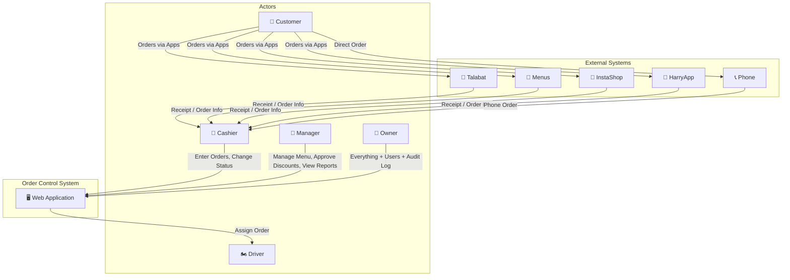
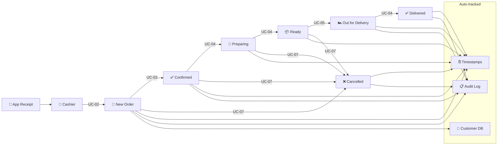

# Use Cases — Order Control System

## Actors

| Actor | الوصف |
|-------|-------|
| **Cashier (الكاشير)** | الموظف اللي بيستلم الأوردرات من التطبيقات وبيدخلها في النظام |
| **Manager (المدير)** | بيشرف على العمليات، بيوافق على الخصومات، بيدير المنيو |
| **Owner (صاحب المطعم)** | بيشوف كل حاجة، التقارير الشهرية، إدارة المستخدمين |
| **Driver (المندوب)** | بيستلم الطلبات ويوصلها — مش بيستخدم النظام مباشرة |
| **Customer (العميل)** | بيطلب من التطبيقات — مش بيستخدم النظام مباشرة |

---

## UC-01: تسجيل الدخول

| العنصر | التفاصيل |
|--------|----------|
| **Actor** | Cashier / Manager / Owner |
| **Precondition** | المستخدم عنده حساب مسجل في النظام |
| **Main Flow** | 1. المستخدم يدخل Email + Password 2. النظام يتحقق من البيانات عبر Supabase Auth 3. النظام يحدد الـ Role 4. النظام يوجه المستخدم للـ Dashboard المناسب |
| **Alt Flow** | 2a. بيانات غلط → رسالة خطأ + إعادة محاولة |
| **Postcondition** | المستخدم logged in ويشوف الواجهة حسب دوره |

---

## UC-02: إدخال أوردر جديد

| العنصر | التفاصيل |
|--------|----------|
| **Actor** | Cashier |
| **Precondition** | الكاشير logged in + عنده رسيت من التطبيق |
| **Main Flow** | 1. الكاشير يضغط "أوردر جديد" 2. يختار المنصة (Talabat/Menus/InstaShop/HarryApp/Phone) 3. يختار البراند (Flower/Mastery/Niwa/Tobiko) 4. يدخل رقم الأوردر الخارجي (External ID) 5. يدخل بيانات العميل (اسم + تليفون + عنوان) 6. النظام يبحث بالتليفون → لو العميل موجود يعبي البيانات أوتوماتيك 7. يختار المنتجات من المنيو (حسب البراند) + الكمية 8. النظام يحسب الـ subtotal أوتوماتيك 9. يختار طريقة الدفع (Cash/Visa/Online) 10. يختار الـ Zone ← النظام يحسب رسوم التوصيل أوتوماتيك 11. يضيف ملاحظات (اختياري) 12. يضغط "حفظ" 13. النظام يسجل الأوردر بحالة "New" + timestamp أوتوماتيك 14. النظام يسجل في Audit Log |
| **Alt Flow** | 6a. عميل جديد → النظام يعمل record جديد في Customer DB 10a. لو التوصيل بمناديب التطبيق → رسوم التوصيل = 0 |
| **Postcondition** | أوردر جديد مسجل + العميل متسجل/متحدث في Customer DB |
| **Business Rules** | - الوقت يتسجل أوتوماتيك (createdAt) - رقم الأوردر يتولد أوتوماتيك - السعر يتحسب من المنيو مش بيدخله الكاشير يدوي |

---

## UC-03: تأكيد الأوردر

| العنصر | التفاصيل |
|--------|----------|
| **Actor** | Cashier |
| **Precondition** | أوردر بحالة "New" |
| **Main Flow** | 1. الكاشير يتصل بالعميل يراجع تفاصيل الطلب 2. يضغط "تأكيد" على الأوردر 3. النظام يغير الحالة من New → Confirmed 4. يتسجل confirmedAt أوتوماتيك 5. Audit Log |
| **Alt Flow** | 2a. العميل عايز يعدل → الكاشير يعدل ويحفظ قبل التأكيد 2b. العميل مش عايز → UC-07 (إلغاء) |
| **Postcondition** | الأوردر بحالة Confirmed |

---

## UC-04: تحريك الأوردر عبر المراحل

| العنصر | التفاصيل |
|--------|----------|
| **Actor** | Cashier |
| **Precondition** | أوردر بحالة سابقة صالحة |
| **Transitions** | Confirmed → Preparing (preparingAt) Preparing → Ready (readyAt) Ready → Out for Delivery (outForDeliveryAt + driverId) Out for Delivery → Delivered (deliveredAt) |
| **Business Rules** | - كل transition بتتسجل بـ timestamp - لازم يمشي بالترتيب (State Machine) — مش ممكن يروح من New لـ Delivered مباشرة - عند Ready → Out for Delivery لازم يختار المندوب - كل تغيير يتسجل في Audit Log |

---

## UC-05: تعيين مندوب

| العنصر | التفاصيل |
|--------|----------|
| **Actor** | Cashier |
| **Precondition** | أوردر بحالة "Ready" |
| **Main Flow** | 1. الكاشير يختار المندوب من القائمة 2. يختار نوع التوصيل (مندوب خاص / تطبيق / خارجي / العميل) 3. لو مندوب التطبيق → رسوم التوصيل = 0 4. النظام يسجل driverId + driverAssignedAt 5. الحالة تتغير لـ "Out for Delivery" |
| **Postcondition** | الأوردر متعين لمندوب + حالته Out for Delivery |
| **Business Rules** | - اسم المندوب يتسجل عشان يتحاسب على الكاش |

---

## UC-06: إضافة خصم على أوردر

| العنصر | التفاصيل |
|--------|----------|
| **Actor** | Cashier (يطلب) → Manager/Owner (يوافق) |
| **Precondition** | أوردر مش ملغي |
| **Main Flow** | 1. الكاشير يضغط "إضافة خصم" 2. يدخل مبلغ الخصم + السبب (إجباري) 3. الطلب يتبعت للمدير/الأونر للموافقة 4. المدير يوافق أو يرفض 5. لو موافق → الخصم يتطبق + discountApprovedBy يتسجل 6. Audit Log |
| **Alt Flow** | 4a. المدير يرفض → الخصم مايتطبقش + الكاشير يتبلغ |
| **Business Rules** | - **Backend Validation**: الـ API يرفض أي خصم من غير discountReason - **Backend Validation**: الـ API يرفض أي خصم من غير discountApprovedBy (Manager/Owner) - مش بس UI — الحماية في الـ API نفسه |

---

## UC-07: إلغاء أوردر

| العنصر | التفاصيل |
|--------|----------|
| **Actor** | Cashier (مع تواصل للمدير) |
| **Precondition** | أوردر مش بحالة Delivered أو Cancelled |
| **Main Flow** | 1. الكاشير يضغط "إلغاء" 2. يختار سبب الإلغاء (من قائمة محددة) 3. لو "أخرى" → يكتب ملاحظة 4. النظام يغير الحالة لـ Cancelled + cancelledAt 5. Audit Log |
| **Cancel Reasons** | تغيير رأي العميل / مشكلة توصيل / مشكلة جودة / العميل ما ردش / منتج غير متاح / أخرى |
| **Business Rules** | - **لا يوجد Hard Delete أبدًا** — الأوردر يفضل موجود بحالة Cancelled - cancelReason إجباري |

---

## UC-08: إدارة المنيو

| العنصر | التفاصيل |
|--------|----------|
| **Actor** | Manager / Owner |
| **Precondition** | Logged in بصلاحية Manager أو Owner |
| **Main Flow** | 1. اختيار البراند 2. عرض الكاتيجوريز والمنتجات 3. إضافة / تعديل / تفعيل-إيقاف كاتيجوري أو منتج 4. تعديل الأسعار |
| **Business Rules** | - الكاشير مايقدرش يعدل المنيو - المنتج بيتقفل (isActive=false) مش بيتمسح - كل تغيير يتسجل في Audit Log |

---

## UC-09: تسجيل مصروف

| العنصر | التفاصيل |
|--------|----------|
| **Actor** | Cashier / Manager / Owner |
| **Main Flow** | 1. يختار نوع المصروف من القائمة 2. يدخل الوصف + الكمية + القيمة 3. التاريخ يتسجل أوتوماتيك 4. يحفظ |
| **Business Rules** | - أنواع المصاريف 20 نوع افتراضي + إمكانية إضافة أنواع جديدة (Manager/Owner بس) |

---

## UC-10: إغلاق اليوم (Daily Closing)

| العنصر | التفاصيل |
|--------|----------|
| **Actor** | Cashier |
| **Precondition** | وردية مفتوحة |
| **Main Flow** | 1. الكاشير يفتح الشيفت (openedAt) 2. خلال اليوم: يدخل أوردرات + مصاريف 3. في نهاية الشيفت يضغط "إغلاق" 4. النظام يحسب أوتوماتيك:    - إجمالي الأوردرات (ناجح / ملغي)    - إجمالي الكاش المحصل    - إجمالي الفيزا/أونلاين    - كاش كل مندوب (اللي لازم يرجعه)    - رسوم التوصيل المحصلة    - المصاريف المسجلة    - صافي الكاش اليومي 5. الكاشير يراجع ويأكد 6. closedAt يتسجل |
| **Business Rules** | - الحسابات تتعمل في `src/lib/closing.ts` (Separation of Concerns) - لازم يكون في وردية مفتوحة عشان يقدر يسجل أوردرات |

---

## UC-11: عرض التقارير

| العنصر | التفاصيل |
|--------|----------|
| **Actor** | Manager / Owner فقط |
| **Main Flow** | 1. يختار نوع التقرير (يومي / شهري / custom) 2. يحدد الفترة 3. النظام يعرض:    - إجمالي الأوردرات (ناجح / ملغي)    - إجمالي المبيعات (كاش / فيزا)    - المبيعات حسب التطبيق + البراند    - رسوم التوصيل    - إجمالي المصاريف حسب النوع    - صافي الإيرادات    - متوسط قيمة الطلب (AOV)    - كاش المناديب    - أفضل منتجات مبيعاً 4. إمكانية تصدير PDF / Excel |
| **Business Rules** | - **Backend validation**: الـ API يتحقق من الـ Role — الكاشير مايشوفش التقارير |

---

## UC-12: عرض داشبورد العميل

| العنصر | التفاصيل |
|--------|----------|
| **Actor** | Cashier / Manager / Owner |
| **Main Flow** | 1. البحث عن عميل بالتليفون أو الاسم 2. النظام يعرض:    - بيانات العميل الأساسية    - عدد الطلبات الكلي    - آخر طلب    - الطلبات المشاكل (ملغية / مشاكل جودة / مشاكل توصيل)    - تاريخ كل الطلبات    - هل عميل أول مرة ولا returning |
| **Postcondition** | صورة كاملة عن العميل |

---

## UC-13: عرض Audit Log

| العنصر | التفاصيل |
|--------|----------|
| **Actor** | Owner فقط |
| **Main Flow** | 1. يفتح صفحة سجل المراقبة 2. يفلتر حسب: الموظف / نوع العملية / التاريخ 3. يشوف: مين عمل إيه + إمتى + القيمة القديمة + القيمة الجديدة |
| **Business Rules** | - **Backend**: فقط Owner يقدر يشوف الـ Audit Log |

---

## UC-14: إدارة المستخدمين

| العنصر | التفاصيل |
|--------|----------|
| **Actor** | Owner فقط |
| **Main Flow** | 1. عرض قائمة المستخدمين 2. إضافة مستخدم جديد (اسم + email + password + role) 3. تعديل بيانات مستخدم أو تغيير دوره 4. إيقاف مستخدم (مش حذف) |

---

## UC-15: إدارة مناطق التوصيل

| العنصر | التفاصيل |
|--------|----------|
| **Actor** | Manager / Owner |
| **Main Flow** | 1. عرض قائمة المناطق + الأسعار 2. إضافة منطقة جديدة + السعر 3. تعديل سعر منطقة موجودة 4. إيقاف / تفعيل منطقة |
| **Business Rules** | - السعر لازم يكون قابل للتعديل في أي وقت (طلب العميل) |

---

## UC-16: إدارة المناديب

| العنصر | التفاصيل |
|--------|----------|
| **Actor** | Manager / Owner |
| **Main Flow** | 1. عرض قائمة المناديب 2. إضافة مندوب (اسم + نوع: خاص/تطبيق/خارجي) 3. تعديل بيانات مندوب 4. إيقاف / تفعيل مندوب |

---

## System Context Diagram

---

## Data Flow — Order Lifecycle

---

## Role-Permission Matrix

| الصلاحية | Cashier | Manager | Owner |
|-----------|---------|---------|-------|
| إدخال أوردر | ✅ | ✅ | ✅ |
| تغيير حالة الأوردر | ✅ | ✅ | ✅ |
| إلغاء أوردر | ✅ (مع سبب) | ✅ | ✅ |
| حذف أوردر | ❌ | ❌ | ❌ |
| إضافة خصم | طلب فقط | ✅ موافقة | ✅ موافقة |
| تعيين مندوب | ✅ | ✅ | ✅ |
| إدارة المنيو | ❌ | ✅ | ✅ |
| تسجيل مصروف | ✅ | ✅ | ✅ |
| إضافة نوع مصروف | ❌ | ✅ | ✅ |
| إغلاق اليوم | ✅ | ✅ | ✅ |
| التقارير اليومية | ❌ | ✅ | ✅ |
| التقارير الشهرية | ❌ | ❌ | ✅ |
| Audit Log | ❌ | ❌ | ✅ |
| إدارة المستخدمين | ❌ | ❌ | ✅ |
| إدارة المناطق | ❌ | ✅ | ✅ |
| إدارة المناديب | ❌ | ✅ | ✅ |
| داشبورد العملاء | ✅ (أساسي) | ✅ (كامل) | ✅ (كامل) |
